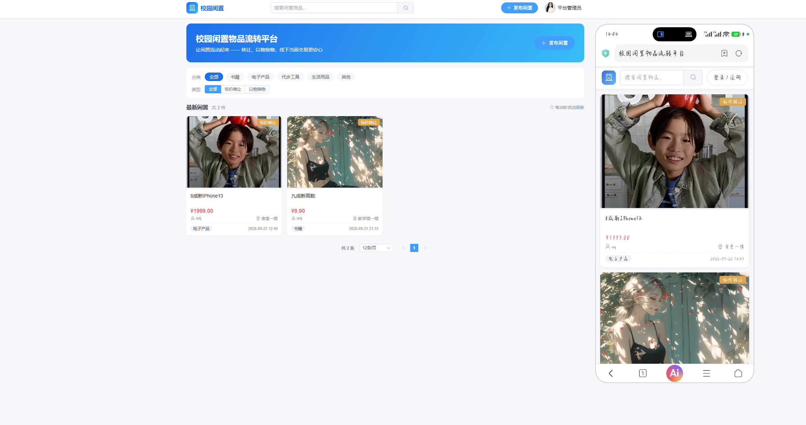
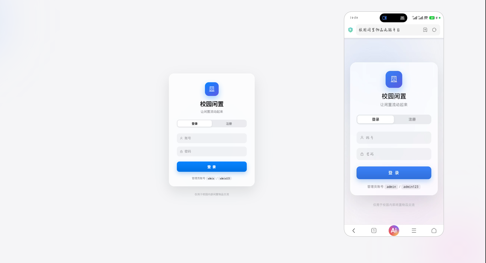
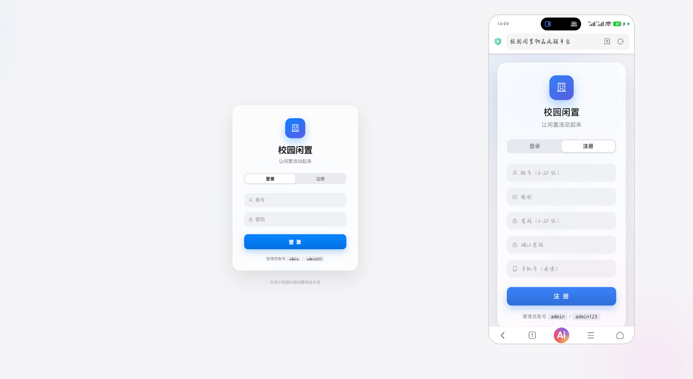
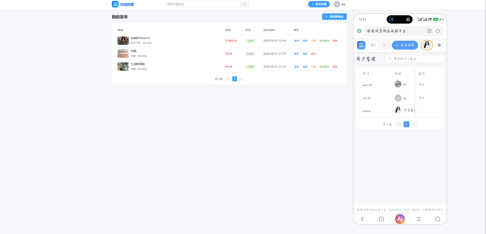
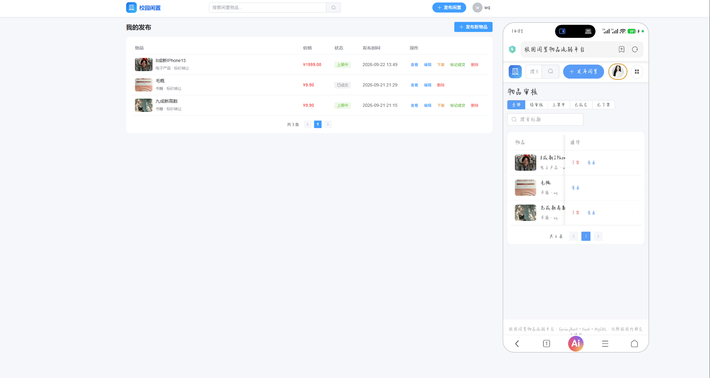
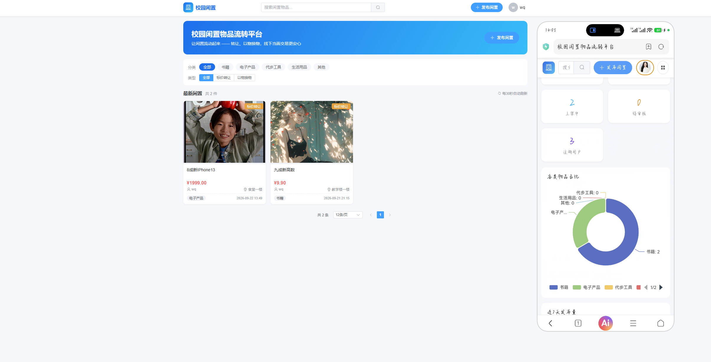

# 校园闲置物品流转平台

面向在校师生的闲置物品流转平台：发布闲置、分类检索、留言咨询、预约线下当面交易，支持**标价转让**与**以物换物**两种流转方式。PC / 手机浏览器双端响应式访问，数据统一存储在后端 MySQL。

## 一、功能一览

### 公共模块（PC / 手机均可用）
- 用户注册、登录、退出；个人资料修改（昵称、头像、手机号）
- 首页物品卡片列表：图片预览、标题、类别、价格/交换类型、发布人、发布时间
- 分类筛选：书籍 / 电子产品 / 代步工具 / 生活用品 / 其他
- 关键词搜索；物品详情页（多图预览、描述）
- 留言板块：用户留言咨询

### 普通用户专属
- 发布闲置：标题、描述、分类、多图上传、流转类型（标价转让 / 以物换物）、期望交易地点
- 我的发布管理：修改信息、下架、标记已成交、删除
- 预约线下交易：对心仪物品发起预约
- 我的预约记录、我的收藏、个人中心

### 管理员后台
- 用户管理：查看全部用户、禁用 / 启用违规账号
- 物品审核：新发布物品待审核，通过后前台可见；直接下架违规物品
- 留言管理：删除违规留言
- 数据看板：总发布 / 成交 / 上架 / 待审核 / 用户总数

## 二、技术栈

| 层 | 技术 |
|---|---|
| 后端 | Spring Boot 2.7 · MyBatis-Plus 3.5 · MySQL 8 · Hutool（MD5 加盐 / JWT） |
| 前端 | Vue 3 · Vite 5 · Element Plus · Pinia · Vue Router · Axios · ECharts 5 |
| 工具 | Maven · IDEA · VSCode |

## 三、项目结构

```
campus-item-transfer/
├── backend/                 # SpringBoot 后端
│   ├── pom.xml
│   └── src/main/
│       ├── java/com/campus/transfer/
│       │   ├── common/      # 统一返回、异常、JWT、登录上下文
│       │   ├── config/      # 拦截器、跨域、静态资源
│       │   ├── controller/  # 接口层
│       │   ├── dto/         # 请求与视图对象
│       │   ├── entity/      # 数据实体
│       │   ├── mapper/      # MyBatis-Plus Mapper
│       │   └── service/     # 业务逻辑
│       └── resources/application.yml
├── frontend/                # Vue3 前端
│   ├── package.json
│   └── src/
│       ├── api/             # axios 封装与接口定义
│       ├── router/          # 路由与守卫
│       ├── store/           # Pinia 用户状态
│       ├── components/      # 物品卡片、头像组件
│       ├── views/           # 页面（首页/详情/发布/我的/管理后台）
│       └── styles/          # 全局样式与响应式布局
└── docs/                    # 操作说明
```

## 四、图片存储说明

物品图片与头像通过 `/api/user/upload` 上传，保存到后端运行目录下的 `upload/` 文件夹，并通过 `/upload/**` 静态映射直接访问，无需云存储。

## 五、安全说明

- 密码 MD5 加盐存储
- 登录使用 JWT（HS256）
- 后端按注解控制权限：公开接口、需登录接口、管理员专属接口
- 表单前后端双重校验，防止空内容提交


## 项目演示截图







## 技术交流

> 仅用于源码技术交流学习

